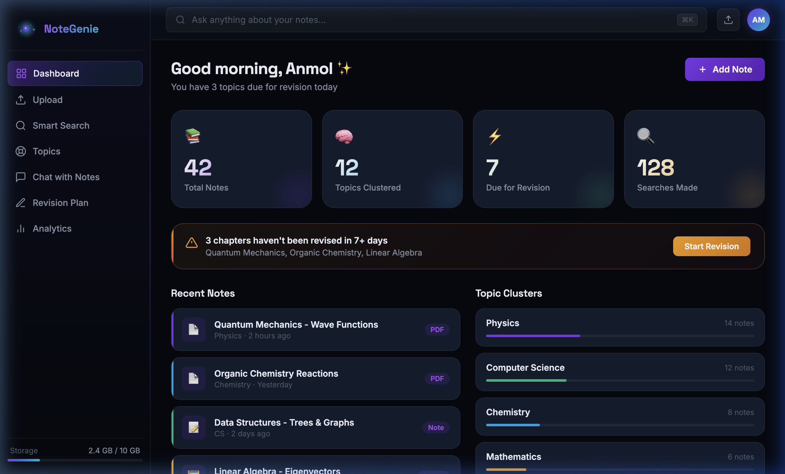

<div align="center">
  

  <h1>🧞 NoteGenie</h1>
  <p><strong>Your AI-Powered "Second Brain" for Study Materials</strong></p>

  <p>
    NoteGenie transforms scattered notes (PDFs, images, and documents) into a searchable, summarized, and revision-ready knowledge system.
  </p>
</div>

---

## 🚀 Core Features

### 📂 Smart Resource Upload
- Drag-and-drop interface for seamless file uploads
- Supports PDFs, Images, TXT, and DOCX files
- Interactive 3D upload zone UI
- Simulated AI processing feedback and automatic metadata detection

### 🤖 AI-Powered Summarization
- Instantly generates short summaries and detailed explanations
- Extracts key points and formulas
- Converts lengthy content into easy-to-revise formats

### 🔍 Smart Semantic Search
- Search using natural language (e.g., “Quantum Physics notes from last month”)
- Retrieves results based on meaning and synonyms (fuzz-matched), not just exact keywords
- Filters by topic, file type, or date
- Highlights relevant sections directly in the search results

### 🧩 Topic Clustering
- Interactively visualizes how notes connect via an animated 3D network graph
- Automatically groups content into structured categories
- Helps you navigate related study concepts easily

### 💬 Chat with Notes (AI Assistant)
- Ask specific questions directly to your uploaded materials
- Get context-aware answers explicitly referenced from your own notes
- Includes an active sources panel for validation

### 📅 Revision Intelligence
- Tracks when notes were last accessed
- Suggests what to revise next using space-repetition logic
- Visual 14-day streak tracker and a GitHub-style revision heatmap

### 📊 Study Analytics
- Visualizes study habits and knowledge base distribution
- Weekly study activity bar charts
- Interactive topic distribution donut charts

---

## 🛠 Tech Stack

**Frontend Only (Vanilla)**
- **HTML5**: Semantic structure
- **CSS3 / Vanilla CSS**: Advanced glassmorphism design system, CSS variables, native grid/flexbox layouts. No external UI libraries like Tailwind.
- **JavaScript (ES6+)**: Custom `canvas` API implementations for 3D orbs, particle systems, and the dynamic topic network graph.

> **Note:** This current build is a high-fidelity interactive prototype. All UI elements, animations, and transitions are fully built, but "AI features" are mock-simulated via JavaScript to demonstrate the UX.

---

## 🖥 How to Run Locally

Because this project uses zero build tools or dependencies, you can run it instantly on any computer.

1. **Clone the repository:**
   ```bash
   git clone https://github.com/thatanmolmishra/NoteGenie.git
   cd NoteGenie
   ```

2. **Open the App:**
   Simply double-click the `index.html` file in your file explorer, or open it in your browser directly:
   
   *Mac shortcut (terminal):*
   ```bash
   open index.html
   ```

No `npm install`, no localhost required!

---

## 🎨 UI/UX Highlights
NoteGenie features an ultra-premium dark theme inspired by Vercel and Linear, utilizing:
- **Custom Canvas Elements:** The background particles, spinning atom orbs, and knowledge graph physics are all hand-coded in `<canvas>`.
- **Micro-interactions:** Interactive hover states on cards, glowing borders on focus, and smooth page transitions.
- **Responsive Design:** Optimized for both desktop and mobile layouts.

---

<div align="center">
  <i>Built with ✨ by <a href="https://github.com/thatanmolmishra">Anmol Mishra</a></i>
</div>